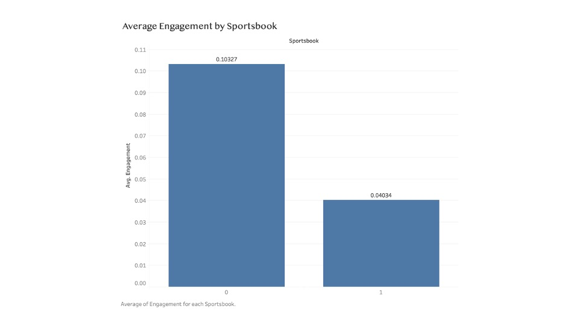
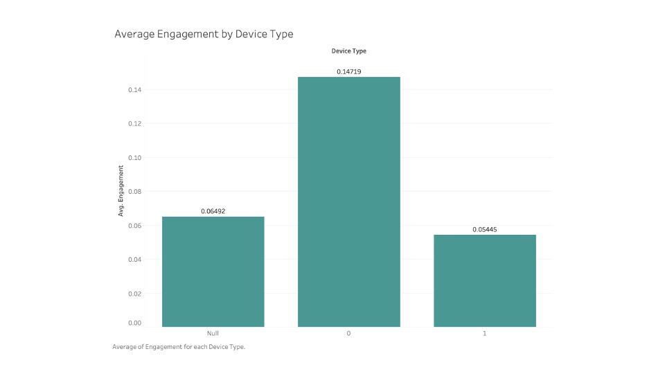
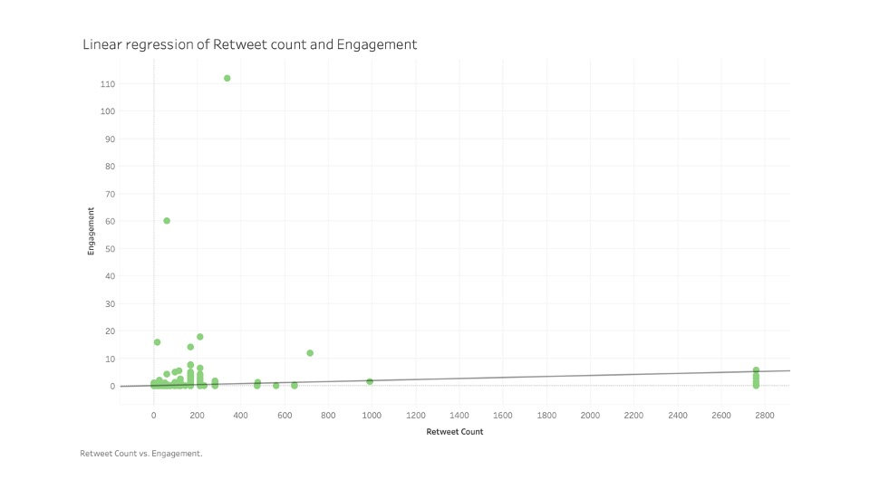

# FanDuel vs. DraftKings: Measuring Sportsbook Engagement on Twitter

**Sentiment analysis + statistical testing on ~8,400 tweets to quantify how user engagement differs between the two largest U.S. sportsbooks.**

Built with Python (pandas, NLTK, TextBlob, statsmodels, SciPy, seaborn) and Tableau.

## TL;DR — Key Findings

| Finding | Evidence |
|---|---|
| **DraftKings drives significantly higher engagement than FanDuel** | OLS `sportsbook` coefficient −0.059 (p = 0.014); Mann-Whitney U test p ≈ 1.6e−12 |
| **Retweets and impressions are the strongest positive drivers of engagement** | Coefficients +0.0010 and +0.0005, both p < 0.001 |
| **Android users engage more than iPhone users** | `device_type` coefficient −0.0806 (p = 0.004) |
| **Tweet sentiment alone doesn't predict engagement** | Polarity/subjectivity not significant; both books average slightly positive sentiment (~0.12 polarity) |



## Why This Matters

FanDuel and DraftKings spend heavily on social promotion, but engagement is not evenly rewarded across platforms, content types, or even devices. Quantifying *what actually moves engagement* tells a sportsbook where marketing dollars work hardest — e.g., DraftKings' promo-heavy strategy (deposit matches, "free square" bets) correlates with measurably higher engagement, and the retweet→engagement relationship supports influencer/promo-code marketing.

## Data

- **Source:** Twitter, collected via the Twitter API (tweets mentioning each sportsbook)
- **Window:** February 27 – March 1, 2022
- **Size:** 8,406 tweets (4,145 FanDuel + 4,261 DraftKings), 18 raw fields including text, sentiment polarity/subjectivity, favorites, retweets, followers, friends, source device

Raw inputs live in [`data/`](data). Derived datasets (combined books, engineered features) are generated by the notebook into `data/derived/`.

## Method

1. **Feature engineering** — `impressions = favorites + retweets`, `reach = followers + friends`, `engagement = impressions / reach`
2. **Combine sportsbooks** — single dataset with binary indicators: `sportsbook` (DraftKings = 0, FanDuel = 1) and `device_type` (Android = 0, iPhone = 1) parsed from the tweet source
3. **Sentiment analysis** — TextBlob polarity and subjectivity on cleaned tweet text (NLTK stopword removal + tokenization)
4. **OLS regression** — engagement on sentiment, audience, and platform variables; a first pass surfaced a perfect-R² overfit from including `engagement_rate` (a direct transform of the target), which was diagnosed and removed
5. **Mann-Whitney U test** — non-parametric confirmation that the engagement difference between sportsbooks is significant
6. **Visualization** — seaborn scatter/box plots and Tableau dashboards

## Selected Figures

| Engagement by device type | Retweets vs. engagement |
|---|---|
|  |  |

## Repository Structure

```
betting_engagement_analysis.ipynb   # full analysis pipeline
data/                               # raw FanDuel & DraftKings tweet datasets
docs/                               # full written report (methodology, figures, citations)
figures/                            # exported charts
results/                            # regression output, Mann-Whitney results, summary stats
tableau/                            # Tableau workbooks for the dashboards
```

## Run It

```bash
pip install -r requirements.txt
jupyter notebook betting_engagement_analysis.ipynb
```

## Limitations & Future Work

- **Short window:** three days during a light sports calendar; an October window (NFL + NBA + MLB + NHL) would capture richer behavior
- **Generic sentiment model:** TextBlob isn't trained on sports-betting language ("unpredictable" is bad for a car, great for a parlay); a domain-trained supervised model is the natural next step
- **Low R² (0.03):** engagement is driven by many factors outside this feature set — promotions, events, and content type are prime candidates for added variables

## Full Report

The complete write-up — literature review, empirical strategy, regression tables, and works cited — is in [`docs/`](docs).

---

*Related project: [Social-Media-Analysis](https://github.com/Chalamar/Social-Media-Analysis) — network analysis of Twitter/Facebook social graphs and a Spotify Top-100 EDA.*
